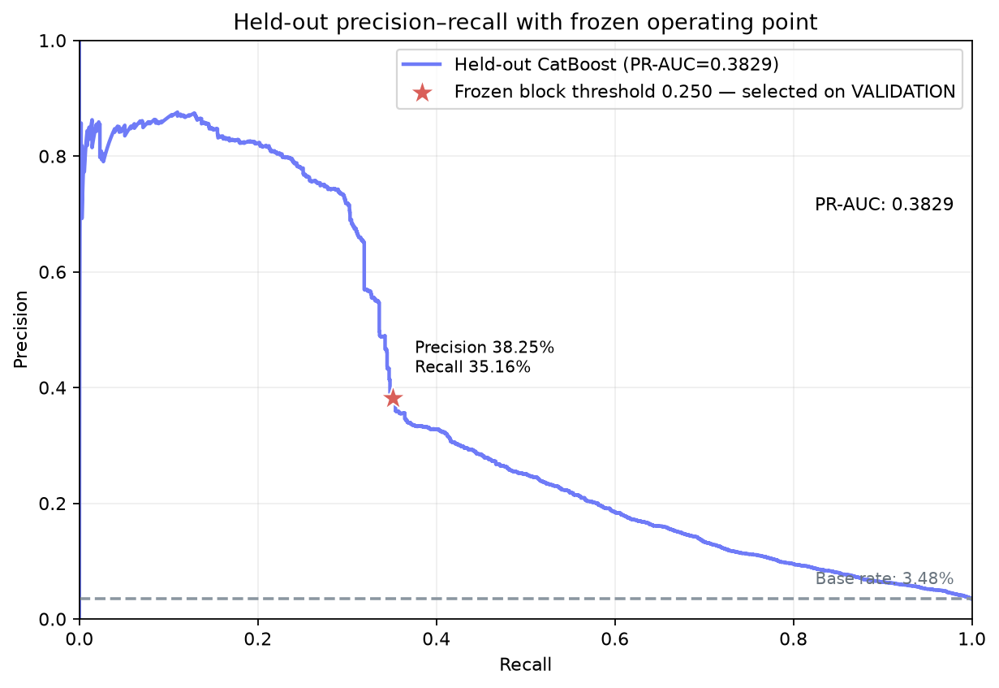

# MerchantShield

MerchantShield is a defense-only, cost-aware fraud decision engine for merchants. It converts a model risk score and validation-derived rules into one of three actions—`APPROVE`, `REVIEW`, or `BLOCK`—then records human review and measures the estimated merchant cost of that configuration.

Current evidence status: the official local IEEE-CIS labeled training files passed validation and EDA, chronological 70/15/15 partitions were frozen, and TRAIN-fitted Logistic Regression and CatBoost candidates were compared on VALIDATION. The identity-free CatBoost candidate and Scenario B thresholds were then frozen and evaluated once on the held-out temporal test. At the block threshold, held-out precision is 38.25%—an ~11× lift over the 3.48% fraud base rate—with recall 35.16% and fraud-value capture 36.21%, at an estimated total cost of ₹454,825.32 on this set. No rule was enabled because no validation-supported rule had been accepted. Protected rows and model bundles remain local and ignored by git.

## Problem

Fraud loss, false declines, chargebacks, and manual review all cost money. A detector that maximizes a single classification metric can still make a poor merchant decision: aggressive blocking may catch more fraud while rejecting profitable legitimate payments, and broad review may overwhelm analysts.

MerchantShield makes the decision economics explicit and keeps the analyst in the loop.

## Why Accuracy Is Not Enough

Fraud is rare, so a model can achieve high accuracy while missing the cases that matter. The primary evidence is therefore:

- precision, recall, F1, and average precision / PR-AUC;
- false-positive and false-negative counts;
- decision volumes for approve, review, and block;
- transparent fraud-loss, false-positive, and review costs;
- actual model errors from a later-in-time held-out set.

## System Design

```text
IEEE-CIS labeled train files
  → left join identity on TransactionID
  → chronological 70/15/15 split
  → local Parquet splits under data/processed/ieee-cis
  → train-only preprocessing
  → Logistic Regression baseline vs CatBoost
  → validation model/feature/threshold/rule decisions
  → one final held-out test evaluation
  → FastAPI + PostgreSQL
  → Overview / Risk Check / Transactions / Review Queue / Cost Lab
```

PostgreSQL is the application source of truth for model metadata, final metrics, threshold and cost configurations, selected transaction predictions, explanations, rule hits, reviews, and optional cost-simulation history. The full IEEE-CIS dataset never enters PostgreSQL. The hosted frontend shows `Not evaluated yet` when a remote FastAPI deployment is not configured with real evidence.

## Real Dataset

The only performance dataset is the [IEEE-CIS Fraud Detection](https://www.kaggle.com/c/ieee-fraud-detection) labeled training data:

- `data/raw/ieee-cis/train_transaction.csv`
- `data/raw/ieee-cis/train_identity.csv`

The loader performs a left join on `TransactionID`; transactions without an identity row remain valid data and receive `identity_available=false`. Kaggle raw files remain under `data/raw/`; the chronological ML splits are Parquet files under `data/processed/ieee-cis/`. Credentials, raw/processed rows, models, and prediction-row exports are gitignored and must stay local. See [data/README.md](data/README.md).

## Temporal Evaluation Strategy

Rows are sorted by `TransactionDT`, then split approximately:

- first 70%: training and train-only preprocessing fit;
- next 15%: model comparison, feature selection, calibration decisions, threshold tuning, cost search, and rule design;
- final 15%: held-out test used only after all decisions are frozen.

Automated tests verify chronological ordering and disjoint `TransactionID` sets. Random splitting is not the primary evaluation.

## Models

The comparison is intentionally narrow:

1. Logistic Regression with TRAIN-only imputation, scaling, one-hot encoding, and balanced/unweighted comparisons is complete on VALIDATION.
2. CatBoost with native categorical handling was compared under none, Balanced, and SqrtBalanced weighting. The selected identity-free candidate has now received its one final held-out evaluation without retraining.

Masked IEEE-CIS fields such as `V17` or `C1` are never assigned invented business meanings. The pipeline does not use SMOTE by default and does not run a giant hyperparameter search.

## Actual Results

<!-- RESULTS:START -->
MerchantShield's block policy turns a 3.48% fraud base rate into 38.25% precision at the block boundary—an **~11× lift over base rate**—while pricing every outcome (missed fraud, false positives, manual review) into an explicit estimated cost.

**Base rate:** 3,083 fraud / 88,581 transactions = 3.48%

| Held-out metric | Value |
|---|---:|
| Transactions | 88,581 |
| Fraud cases | 3,083 (3.48% base rate) |
| Precision at block threshold | 0.3825 (~11× base-rate lift) |
| Recall at block threshold | 0.3516 (35.16% of fraud cases caught) |
| Fraud-value capture | 36.21% of fraudulent transaction value |
| Share of traffic blocked | 3.20% |
| F1 | 0.3664 |
| Average precision / PR-AUC | 0.3829 |
| False positives | 1,750 |
| False negatives | 1,999 |
| Total estimated cost (INR) | 454,825.32 |



The frozen block threshold (star) sits ~11× above the fraud base rate line, selected on VALIDATION before this held-out evaluation was run once.

**Reading these numbers:** fraud is rare, so precision must be judged against the 3.48% base rate, not against 1.0. At the frozen block threshold, the policy blocks only 3.20% of all traffic while capturing over a third of both fraud cases and fraud value—and every false positive, missed fraud case, and manual review is priced into the ₹454,825 total estimated cost above, under the business assumptions in `ml/configs/merchant_scenarios.yaml`.

**Frozen policy, no post-test tuning.** The threshold, model, and feature set were selected on VALIDATION only and frozen before the one held-out test run. No threshold or rule was altered after seeing held-out results. Any future rule remains validation-only until evaluated on a fresh, previously untouched split—this held-out set is not reused for further tuning.
<!-- RESULTS:END -->

This section is updated from `artifacts/metrics/final_test_metrics.json` by `ml/scripts/render_readme_results.py`; it is not manually maintained in multiple places. The PR curve is generated by `ml/scripts/plot_final_pr_curve.py` exclusively from the already-written local `final_test_predictions.csv` and final metrics—it never regenerates predictions or reopens the held-out source rows.

Technical validation baseline: the selected unweighted conservative combined Logistic Regression reached AP 0.231434 and ROC-AUC 0.793480 on VALIDATION. At the descriptive 0.50 threshold it reached precision 0.723333 and recall 0.071335, exposing an unsuitable default-threshold tradeoff. These are model-development results, not final merchant-facing metrics.

Technical validation candidate: identity-free CatBoost reached AP 0.426003 and ROC-AUC 0.860332 on VALIDATION. At 0.50 it reached precision 0.769552 and recall 0.242604. This is an 84.07% relative AP improvement over the linear baseline, but it remains development evidence—not final held-out or merchant-facing performance.

## Cost Model

For each transaction:

- `APPROVE` fraud incurs the configured fraud fraction of amount plus fixed chargeback cost.
- `BLOCK` legitimate traffic incurs configured lost margin plus fixed false-positive cost.
- `REVIEW` always incurs manual review cost, then residual fraud or false-positive cost based on reviewer-effectiveness assumptions.

The scenarios in `ml/configs/merchant_scenarios.yaml` are illustrative placeholders, not industry facts. Cost Lab visually separates model-derived outcomes from merchant-configurable assumptions. Threshold search uses validation predictions only and reports the **lowest estimated cost under the currently selected merchant assumptions and review-capacity limit**, never a universal optimum.

## What Didn't Work

The initial SAGA baseline run failed to converge within 1,000 iterations for all seven fits and was discarded. A documented switch to `newton-cholesky` produced converged final fits. The selected unweighted baseline also demonstrates that the conventional 0.50 threshold can produce high precision while missing most fraud; it is not an operational threshold.

## Product Demo

The UI contains five main sections:

- Overview: real dataset, chronological split, Logistic Regression/CatBoost validation evidence, feature importance, failure analysis, and separately identified final held-out results.
- Risk Check: single-transaction scoring, label-safe validation-transaction loading, and temporary exact-schema CSV scoring through the frozen CatBoost validation candidate and provisional validation thresholds. Batch files are limited to 1 MB and 1,000 data rows and are not persisted.
- Transactions: real validation labels and scores, the model class at 0.50, provisional three-way business decisions, thresholds, selected input fields, estimated per-decision cost, backend filters, interesting cases, and visible `MODEL ERROR` flags.
- Review Queue: real rows inside the provisional validation review band, hidden ground truth until explicit reveal, and PostgreSQL-persisted `APPROVE` / `BLOCK` reviewer decisions. Review actions do not change model artifacts or metrics.
- Cost Lab: interactive validation-only scenario, threshold, and review-capacity controls; dynamic policy/cost comparisons; separate fraud-count detection and fraud-amount capture; residual-risk and sensitivity evidence. Every monetary output is labelled as an estimate under illustrative assumptions.

When protected competition rows or the local model bundle cannot be deployed, the hosted frontend reports the unavailable evidence service instead of substituting scores. The complete Risk Check runs with the local FastAPI service and saved CatBoost candidate.

## Setup

Prerequisites: Node.js 22+, Python 3.11+, a PostgreSQL service (local Docker or managed), and authorized access to the Kaggle dataset.

```bash
cp .env.example .env
make setup
make db-up
make db-migrate
make data-check
make prepare-data
make eda
make train-baseline
make train-primary
make threshold-analysis
make error-analysis
make test
make lint
make typecheck
```

The commands above stop before held-out evaluation. After the CatBoost model, feature schema,
validation thresholds, rule policy, and merchant assumptions are frozen, validate the final
evaluation inputs without reading test rows:

```bash
make evaluate-preflight
```

Only then run the one final held-out evaluation and synchronize its evidence to PostgreSQL:

```bash
make evaluate
make db-sync
```

`make evaluate` loads the existing TRAIN-fitted CatBoost bundle and the VALIDATION-selected
operating configuration. It does not retrain or retune. A durable access record prevents an
accidental second test evaluation.

Run the services separately:

```bash
make api   # http://localhost:8000
make web   # http://localhost:3000
```

Or use PostgreSQL, migrated API, and web together after copying `.env.example` to `.env`:

```bash
docker compose up --build
```

The API container applies Alembic migrations before startup. The generated OpenAPI docs are available at `http://localhost:8000/docs`. Risk Check uses `POST /api/v1/score`, `POST /api/v1/score/batch`, `GET /api/v1/validation/transactions/{transaction_id}`, and the explicit `/ground-truth` subresource. CSV scoring accepts the exact 13 model columns plus an optional `TransactionID`, rejects labels including `isFraud`, limits uploads to 1 MB / 1,000 data rows, and never persists the uploaded file. Artifact-backed dashboard endpoints are `/api/v1/project/status`, `/api/v1/model-comparison`, `/api/v1/model/feature-importance`, `/api/v1/validation/transactions`, and `/api/v1/validation/interesting-cases`. Validation cost endpoints are `/api/v1/cost/scenarios`, `/api/v1/cost/validation-summary`, `/api/v1/cost/simulate`, and `/api/v1/validation/residual-risk` (with `/api/v1/cost/residual-risk` retained as a cost-module alias). Validation review endpoints are `/api/v1/reviews/validation`, `/api/v1/reviews/validation/{transaction_id}/decision`, and `/api/v1/reviews/validation/{transaction_id}/ground-truth`.

## Operational Database

`DATABASE_URL` is required and is the only database location read by FastAPI. There is no Python fallback containing local credentials. Standard `postgres://`, `postgresql://`, and `postgresql+psycopg://` URLs are normalized onto psycopg 3, so local Docker, Neon, or Supabase can be selected without application-code changes.

Local setup uses `.env` (ignored by Git) and a persistent Docker volume named `merchantshield_postgres_data`. The API process on the Mac connects to `localhost:5432`; the API container connects to the Compose service hostname `postgres:5432`.

```bash
cp .env.example .env        # replace change_me
make db-up
make db-status
make db-migrate
curl http://localhost:8000/health/db
```

See [PostgreSQL operations](docs/postgresql-operations.md) for direct SQL checks, Review Queue persistence verification, safe restart instructions, and hosted-database boundaries.

Production sets `ENVIRONMENT=production` and a backend-only Neon/Supabase `DATABASE_URL` containing an approved `sslmode`. Apply the unchanged Alembic migration chain to that database before API startup. The operations guide also documents intentional reset and common Docker, port, authentication, migration, and container-hostname failures.

Alembic owns schema changes:

```bash
make db-migrate  # apply migrations
make db-check    # compare models with migration head on a running database
make db-sync     # copy final model metadata/metrics into runtime tables
```

The operational schema contains `transactions`, `prediction_reasons`, `rule_hits`, `review_cases`, `model_runs`, `threshold_configs`, `cost_configs`, `cost_simulations`, and the normalized tables for enabled secondary workflows. JSONB is limited to genuinely variable metadata such as the feature-name list and split descriptions; transaction features, rule hits, metrics, thresholds, and costs use typed relational columns.

## Repository Layout

```text
apps/web/                 frontend package boundary / Sites adapter
services/api/             FastAPI, SQLAlchemy, PostgreSQL, rules, reviews
ml/src/merchantshield_ml/ reusable modeling and cost package
ml/scripts/               real-data EDA, training, evaluation, seeding
ml/tests/                 correctness fixtures (never performance evidence)
rules/                    empty-until-evidenced merchant rule config
data/                     ignored raw CSV and processed Parquet boundaries
artifacts/                generated metrics/reports/figures/model metadata
docs/                     architecture, decisions, failures, demo guide
```

## Limitations

- The IEEE-CIS data is anonymized and represents a particular commerce environment and time period.
- Some fields have masked semantics, which limits business interpretation.
- Fraud patterns change over time; offline performance does not equal production performance.
- Cost assumptions vary by merchant and must be reviewed before decisions are operationalized.
- False positives can harm customer experience, and manual review adds operational cost.
- Real-data validation, EDA, chronological splitting, Logistic Regression baseline, CatBoost validation selection, and the one final held-out evaluation are complete locally. The held-out precision decline and increased false-positive volume show that the result is not equivalent to production readiness.
- The hosted adapter is stateless until `NEXT_PUBLIC_API_URL` points to a deployed FastAPI service; operational persistence belongs to that service's PostgreSQL database.

## Rejected Scope

We deliberately did not implement Kafka, Neo4j, GNNs, an LLM analyst chatbot, fraud-ring visualization, automatic retraining, or complex microservices. The build prioritizes a complete, measurable fraud-decision loop over superficial breadth.

## Future Work

Possible future work includes stream processing, production drift detection, multi-merchant models, automated rule backtesting, active learning, and real chargeback feedback. No post-test tuning is permitted on the reported held-out result.

## Safety and Data Governance

MerchantShield detects and mitigates fraud; it does not generate attacks or help evade detection. API inputs are validated, SQLAlchemy produces parameterized queries, credentials live only in ignored environment files, and protected dataset rows are not published automatically.
